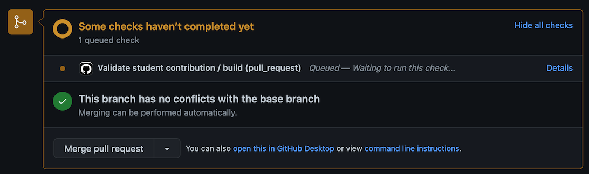
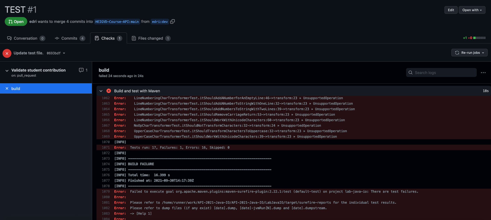

# DAI-2022-Java-IO


Note: the default branch of this repository is named `main` and not `master`, which is the new name recently introduced by GitHub (read why [here](https://www.theserverside.com/feature/Why-GitHub-renamed-its-master-branch-to-main)).

**Warning: do NOT change the code in the test packages!**


## Introduction

The objective of this lab is to get familiar with the Java IO APIs and to interact with the file system. You will implement an application that performs the following tasks:

1. The user invokes the application on the **command line** and provides a numeric argument (*n*).
2. The application **uses a Web Service client** (which is provided to you) to fetch *n* **quotes** from [https://api.quotable.io/random](https://api.quotable.io/random). The original lab used in the past fetched quotes from the [Internet Chuck Norris Database](http://www.icndb.com/api/) online service (which explains the picture shown in this README). The Chuck Norris Database has unfortunately been down (returning a server error) for a while now. This has no impact on your work (although is less funny...).
3. The application stores the content of each quote in a **text file** (utf-8), on the local filesystem. It uses the *tags* associated to each quote to create a hierarchical structure of directories.
4. The application then **traverses the local file system** and applies a transformation to each visited quote file.
5. The processing consists of 1) converting all characters to their **uppercase** value, 2) adding a **line number** at the beginning of each line and 3) converting all line endings to Unix-style line endings (only '\n').

For example: the file

    Hello, this is a text
    with two lines

is converted to:

    1. HELLO, THIS IS A TEXT
    2. WITH TWO LINES


If your application is fully implemented you should have the following result on your machine:

### A. When building the application


```
$ mvn clean package
[INFO] Scanning for projects...
[INFO]
[INFO] --------------------< ch.heigvd.api.io:lab-java-io >--------------------
[INFO] Building API Lab Java IO 1.0-SNAPSHOT
[INFO] --------------------------------[ jar ]---------------------------------
[INFO]
[INFO] ...... Omitting some output
[INFO]
[INFO] -------------------------------------------------------
[INFO]  T E S T S
[INFO] -------------------------------------------------------
[INFO] ...... Omitting some output
[INFO]
[INFO] Results:
[INFO]
[INFO] Tests run: 19, Failures: 0, Errors: 0, Skipped: 0
[INFO]
[INFO] ------------------------------------------------------------------------
[INFO] BUILD SUCCESS
[INFO] ------------------------------------------------------------------------
[INFO] Total time:  5.142 s
[INFO] Finished at: 2021-09-28T11:45:44+02:00
[INFO] ------------------------------------------------------------------------

```

There must be **19** successfully run tests.

### B. When running the application

```
$ java -jar target/lab-java-io-1.0-SNAPSHOT-launcher.jar 5
INFO: Received a new joke with 1 tags.
INFO: > joke
INFO: Received a new joke with 0 tags.
INFO: Received a new joke with 4 tags.
INFO: > geek
INFO: > popular
INFO: > internet
INFO: > hilarious
INFO: Received a new joke with 1 tags.
INFO: > popular
INFO: Received a new joke with 7 tags.
INFO: > movie
INFO: > geek
INFO: > joke
INFO: > popular
INFO: > hilarious
INFO: > funny
INFO: > internet
```

### C. After running the application

```
$ find ./workspace/
./workspace/
./workspace/quotes
./workspace/quotes/geek
./workspace/quotes/geek/popular
./workspace/quotes/geek/popular/funny
./workspace/quotes/geek/popular/funny/internet
./workspace/quotes/geek/popular/funny/internet/joke
./workspace/quotes/geek/popular/funny/internet/joke/hilarious
./workspace/quotes/geek/popular/funny/internet/joke/hilarious/quote-4.utf8
./workspace/quotes/geek/popular/funny/internet/joke/hilarious/quote-4.utf8.out
./workspace/quotes/hilarious
./workspace/quotes/hilarious/popular
./workspace/quotes/hilarious/popular/joke
./workspace/quotes/hilarious/popular/joke/quote-3.utf8
./workspace/quotes/hilarious/popular/joke/quote-3.utf8.out
./workspace/quotes/internet
./workspace/quotes/internet/funny
./workspace/quotes/internet/funny/joke
./workspace/quotes/internet/funny/joke/geek
./workspace/quotes/internet/funny/joke/geek/movie
./workspace/quotes/internet/funny/joke/geek/movie/popular
./workspace/quotes/internet/funny/joke/geek/movie/popular/hilarious
./workspace/quotes/internet/funny/joke/geek/movie/popular/hilarious/quote-1.utf8
./workspace/quotes/internet/funny/joke/geek/movie/popular/hilarious/quote-1.utf8.out
./workspace/quotes/joke
./workspace/quotes/joke/geek
./workspace/quotes/joke/geek/internet
./workspace/quotes/joke/geek/internet/funny
./workspace/quotes/joke/geek/internet/funny/movie
./workspace/quotes/joke/geek/internet/funny/movie/popular
./workspace/quotes/joke/geek/internet/funny/movie/popular/quote-5.utf8
./workspace/quotes/joke/geek/internet/funny/movie/popular/quote-5.utf8.out
./workspace/quotes/movie
./workspace/quotes/movie/popular
./workspace/quotes/movie/popular/internet
./workspace/quotes/movie/popular/internet/funny
./workspace/quotes/movie/popular/internet/funny/hilarious
./workspace/quotes/movie/popular/internet/funny/hilarious/geek
./workspace/quotes/movie/popular/internet/funny/hilarious/geek/quote-2.utf8
./workspace/quotes/movie/popular/internet/funny/hilarious/geek/quote-2.utf8.out
```

You can then compare `quote-8.utf8.out` with `quote-8.utf8` to see the text received as input (from the web service) and the text produced as output (by your program).

## How many branches should I create? How many PRs? When?

For this lab, we will try the following workflow:
* create a branch for the entire lab (you call it "dev", "lab" or whatever you want)
* commit code as soon as possible and push the branch to your fork
* open a PR (_Pull Request_) whose name start with `[WIP] ` (Work In Progress) and finish with the last names of each member of the team. This makes it easier for us to see that you are still working on the lab
* even if tests are still red, we have a communication space while you work on the lab
* whenever you push a new commit, we will be able to see it (and possibly to comment it)
* at some point, all your tests will be green: you can then signal that you are done; for that, change the name of your PR. Replace `[WIP] ` with `[TOREVIEW] `.

Push commits as often as possible (whenever you make progress, turn a test green, etc.).

Once you created your PR, an automatic process will be triggered in it each time you push new code in your branch (in software development we call that a _CI_, a [Continuous Integration](https://www.atlassian.com/continuous-delivery/continuous-integration) process). This process will automatically run all the tests with a `mvn clean test` command (in a private Linux environment hosted by GitHub) and will fail if one of the test did not pass. This will help us to validate your laboratories, and this will also help you to have an automatic feedback on your work.

Whenever you push your code, you will see the automatic checks process triggered in the main tab of your PR as follows:



After a few seconds it will turn red if some tests failed or green if all tests passed. If you want to have more details about the failure just click on the "Details" button to see the reason, for example:



Final note: because you all work in the same packages, we will not merge (more than one) PR at the end of the lab. But we will be able to get your branches and evaluate them.

## Tasks

Here is the proposed list of tasks to achieve the objectives:

1. Start by forking and cloning this repo (**mandatory!!**).
2. Create your own branch, then switch to it.
3. From the main project, do a `mvn clean package` and notice that the tests fail.
4. Spend some time to explore the package structure.
5. Examine the automated tests in the test project and do a step-by-step implementation, until all tests are green. Here is a proposed order for fixing the broken tests:
   - `ApplicationTest.java` (be aware that those tests will be ignored by Maven as long as the other ones won't be completed, and this even if the code of Application.java is correct)
   - `NoOpCharTransformerTest.java`
   - `UpperCaseCharTransformerTest.java`
   - `LineNumberingCharTransformerTest.java`
   - `CombinedCharTransformerTest.java` (which simply validates everything you did in the other transformer classes)
   - `FileExplorerTest.java`
   - `FileTransformerTest.java`
   
   The changes to be made to all implementation files (*NOT THE TEST FILES*) are marked with a 'TODO' comment. Intellij should highlight the comment.
5. Each time that you fix a failing test, `commit` your work (and use a **meaningful message**). Don't forget to create the pull request as soon as possible!
6. When all the tests are green, invoke the application (`java -jar`) from the top-level directory. Inspect the content of the `workspace/quotes` directory and check that the output files are correct.
7. When you are done, make sure that you have committed all your work and push your commits.
8. To make a final validation, move to a fresh directory. Clone your fork. Do a `mvn clean package` and make sure that the tests are still green and that the app still produces the correct output.
9. Check your pull request before renaming it: we don't want to have useless files in it, and all the tests of the automatic tests process we implemented must be green.
